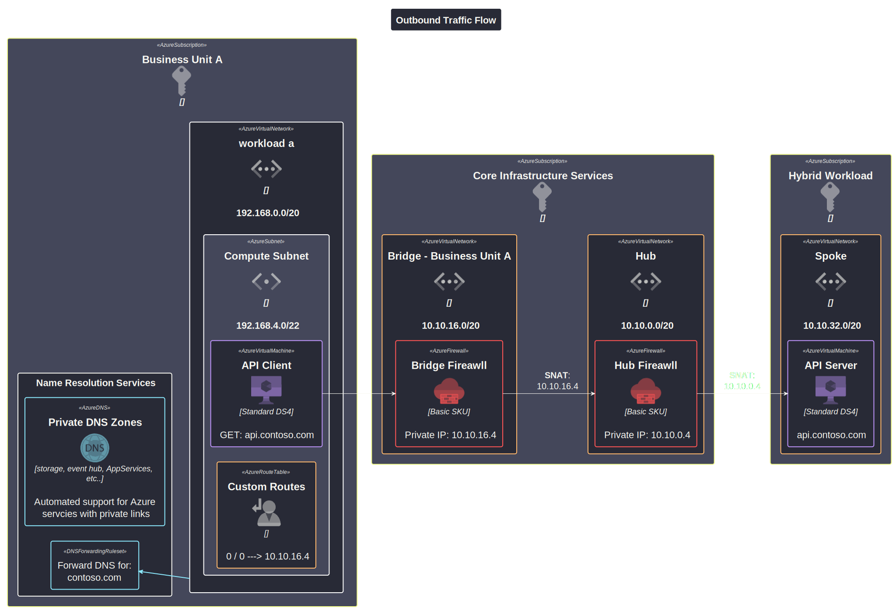

# Isloated Networking Pattern

This reference design introduces the "island networking" pattern which enables application teams to implement secure, privately deployed workloads in a fully self-service manner without constraints often imposed by traditional hybrid networking models. This pattern is achieved by levaraging Azure networking features such as Azure Firewall (SNAT), Private Link, Private Endpoint, Private DNS Zones, and Private DNS Resolver which provide the necessary inbound and outbound integration with the corporate network while maintaining a high degree of isolation and service scalability. This type of design is useful for organizations that:

- Operate in a hub-and-spoke-model
- Use hybrid connectivity to on-premises services
- Are constrained in the amount of available, routable IP addresses
- Use Azure PaaS services that require dedicated IP address ranges
- Need to achieve high scalability with those services
- Have strict network security requirements

## Topology

The following diagram describes the high-level network design:

Business Units within an enterprise are delegated a large IP address space. In this example, its **192.168.0.0/16** (65,526 IP addresses). Cloud native workloads are then grouped into Business Unit subscriptions that include VNETs and name resolution services.

### Outbound Connectivity

Outbound connectivity from workload VNETs is managed through a centralized "bridge" VNET that is connected through peering. The bridge VNET is deployed into the routable coroprate network and hosts an Azure Fireall instance, which is used to forward traffic to three possible destinations: Internet (egress), workload (internal), and to the hybrid / on-premises network. The following diagram outlinse how this is achieved:

In this current design, seamless access to resources hosted on-premises or in the hybrid cloud network address space is achieved using two layers of SNAT provided by the Azure Fireall instances. Name resolution for resources hosted in self-hosted DNS zones is accomplished using Azure Private DNS resolver.

### Inbound Connectivity

### Name Resolution

## Deployment

This reference environment includes two main areas that are deployed in the target subscription.

- [Azure Policies](policies/readme.md) - Ensure a conssitent security baseline is maintained
- [Azure Infrastructure](deployment/readme.md) - Represents the solution design
- [Azure Monitoring](monitoring/readme.md) - Contains information about what's being monitored

Navigate to each link before for instructions on how these assets are be deployed.
