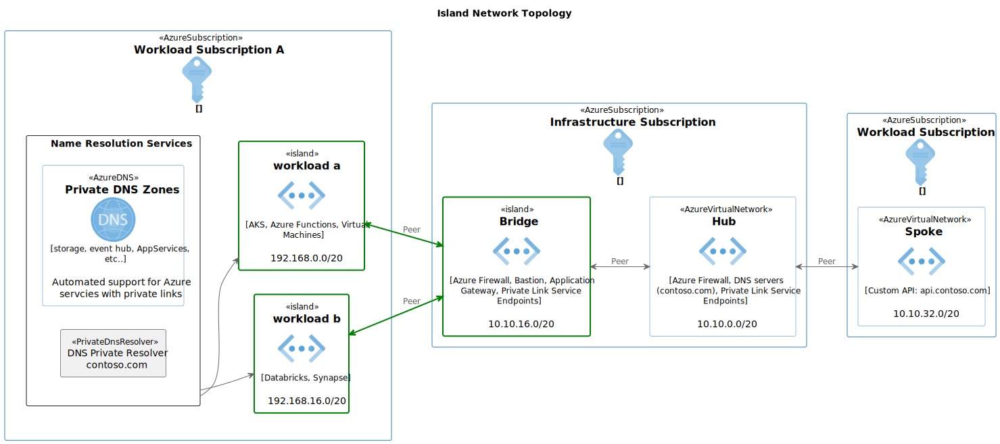

# Isloated Networking

This reference design introduces the "island networking" concept which enables application teams to implement secure, privately deployed workloads in a fully self-service manner without dependencies on enterprise networking. This model leverages Azure networking features such as Private Link, Private Endpoint, Private DNS Zones, and Private DNS Resolver which provide the necessary inbound and outbound integration with the corporate network while maintaining a high degree of isolation and service scalability. This type of design is useful for organizations that:

- Operate in a hub-and-spoke-model
- Use hybrid connectivity to on-premises services
- Are constrained in the amount of available, routable IP addresses
- Wish to provide a faster time-to-value for application teams through self-service provisioning
- Have strict network security requirements

The following diagram describe the basic networking concepts:

## Deployment

This reference environment includes two main areas that are deployed in the target subscription.

- [Azure Policies](policies/readme.md) - Ensure a conssitent security baseline is maintained
- [Azure Infrastructure](deployment/readme.md) - Represents the solution design
- [Azure Monitoring](monitoring/readme.md) - Contains information about what's being monitored

Navigate to each link before for instructions on how these assets are be deployed.
